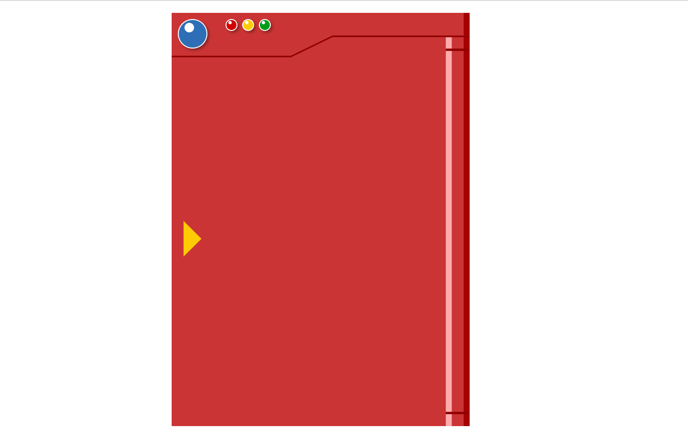
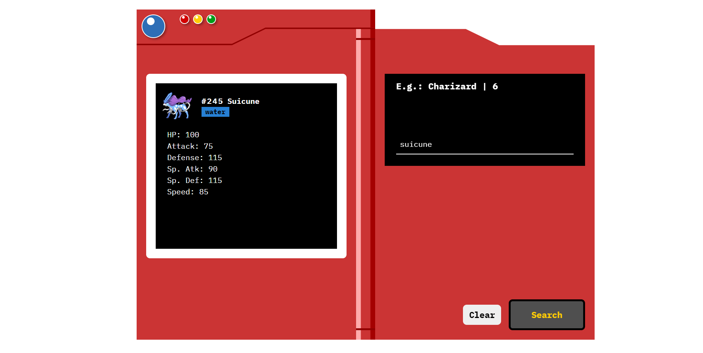

# PokeVue

  <center> <h1> Pokedex Fechada </h1> </center>
  <center > </center>

  <center> <h1> Pokedex após buscar um pokemon </h1> </center>

  <center > </center>


## ⚡ Tecnologias

  Esse projeto foi desenvolvido com as seguintes tecnologias:

  - [Vue.js](https://vuejs.org/)
  - [Scss](https://sass-lang.com/documentation)

## 💻 Projeto
  Uma pokedex animada capaz de achar qualquer pokémon, basta colocar o nome ou seu número,
  também é possível ver seus stats iniciais. 
  Esse projeto foi desenvolvido durante o curso básico vue-js da https://web.digitalinnovation.one/ com o instrutor Rafael Maia https://github.com/rafaelmaiach.

## 📁 Scripts

- Para instalar as dependências use esse comando:
```
yarn install
```

- Para iniciar o projeto no navegador utilize este comando:
```
yarn serve
```

- Para corrigir os erros do lint use este comando:
```
yarn lint
```

